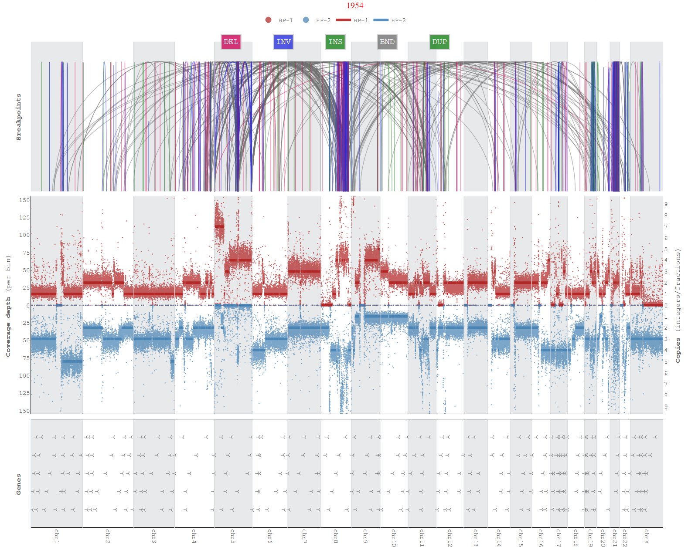

# Wakhan

###### Note: This repository is under extensive updates.

A tool to analyze haplotype-specific chromosome-scale somatic copy number aberrations and aneuploidy using long reads (Oxford Nanopore, PacBio). 
Wakhan takes long-read alignment and phased heterozygous variants as input, and first uses extends the phased blocks, taking
advantage of the CNA differences between the haplotypes. Wakhan then generates inetractive haplotype-specific coverage plots.    

#### Breakpoints/SVs based segmentation and Copy numbers estimation:


[//]: # (#### LOH detection, phasing correction and CopyNumbers profiling &#40;COLO357&#41;:)

[//]: # (<p float="left">)

[//]: # (  )

[//]: # (   )

[//]: # (  )

[//]: # (</p>)

[//]: # (#### Copy number segmentation:)

[//]: # ()

[//]: # ()
[//]: # (#### LOH detection)

[//]: # ()

[//]: # (## Installation &#40;individual packages through conda and pip&#41;)

[//]: # (```)

[//]: # (git clone https://github.com/KolmogorovLab/Wakhan.git)

[//]: # (cd Wakhan/)

[//]: # (conda create --name Wakhan python=3.8)

[//]: # (conda activate Wakhan)

[//]: # (pip install pysam pyfaidx numpy pandas plotly scikit-learn==1.2.0 scipy==1.9.2 ruptures vcf_parser)

[//]: # (conda install -c bioconda samtools bcftools)

[//]: # (cd src/)

[//]: # (```)

## Installation (enabling through conda environment)
```
git clone https://github.com/KolmogorovLab/Wakhan.git
cd Wakhan/
conda env create -f environment.yml -n Wakhan
conda activate Wakhan
cd src/
```

## Usage

### Tumor-Normal Mode (requires normal phased VCF)
```
python main.py --threads <4> --reference <ref.fa>  --target-bam <data.tumor.bam>  --normal-phased-vcf <data.normal_phased.vcf.gz>  --genome-name <cellline/dataset name> --out-dir-plots <genome_abc_output> --breakpoints <severus-sv-VCF>
```
##### Tumor-Normal mixture and purity/ploidy estimation
User can input both `--tumor-ploidy` and `--tumor-purity` to inform copy number model about normal contamination in tumor to estimate copy number states correctly.


### Tumor-only (requires tumor phased/haplotagged BAM and phased VCF)
```
python main.py --threads <4> --reference <ref.fa>  --target-bam <data.tumor_haplotagged.bam>  --tumor-vcf <data.tumor_phased.vcf.gz> --genome-name <cellline/dataset name> --out-dir-plots <genome_abc_output> --breakpoints <severus-sv-VCF>
```

[//]: # (## Note)

[//]: # (If for some reason you have already generated coverage and pileup data from Wakhan &#40;as pileup takes some time&#41; and want to rerun the tool, you can avoid generating coverage/pileup data again by copying this data and using it again:)

[//]: # (1. Copy `coverage.csv`, `coverage_ps.csv` and `<Your genome name>_SNPs.csv` files from `data/` output dir &#40;it should be in src&#41; of your current run to some separate directory i.e.,  `/home/abc/dry_run_data`.)

[//]: # (2. Then run again the tool with adding this command additional to what you use already: `--dryrun True` `--dryrun-path` <This is the path where you copied CSVs files in step-1, ie. like, `/home/abc/dry_run_data/`>)

## Examples
Few cell lines arbitrary phase-switch correction and copy number estimation output with coverage profile is included in the [examples](https://github.com/KolmogorovLab/Wakhan/tree/main/examples) directory. 

## Required parameters
* `--reference` Reference file path

* `--target-bam` path to target bam files (must be indexed)
  
* `--out-dir-plots` path to output coverage plots

* `--genome-name` genome cellline/sample name to be displayed on plots

* `--normal-phased-vcf` normal phased VCF file to generate het SNPs frequncies pileup for tumor BAM (if tumor-only mode, use phased `--tumor-vcf` instead)

* `--tumor-vcf` VCF file to plot snps frequencies, ratios and LOH regions (Note: phased VCF is required in tumor-only mode)

* `--breakpoints` For segmentation to use in CN estimation, structural variations/breakpoints VCF file is required

## Optional parameters
* `--phaseblock-flipping-enable` enabling phaseblock flipping in coverage plots (default: enabled)

* `--phaseblocks-enable` enabling phaseblocks display in coverage plots

* `--contigs` List of contigs (chromosomes, default: chr1-22) to be included in the plots (Note: chrX, chrY support in CNA plots is not included yet) [e.g., chr1-22,X,Y]

* `--cut-threshold` Maximum cut threshold for coverage (readdepth) plots [default: 100]

* `--without-phasing` enable it if CNA analysis is being performed without phasing 

## Output produced
* `<genome-name>_genome_copynumber.html` Genome-wide copy number plots with coverage information on same axis

* `<genome-name>_copynumber_breakpoints.html` Genome-wide copy number plots with coverage information on opposite axis, additionally breakpoints and genes annotations 

* `bed_output` It contains copy numbers and LOH (in case tumor VCF is provided) segments in bed format

* `coverage_plots` Haplotype specific coverage plots for chromosomes with option for unphased coverage

* `variation_plots` Copy number chromosomes-scale plots with segmentation, coverage and LOH/SNPs ratios (in case tumor VCF is provided)

* `phasing_output` Phase-switch error correction plots and phase corrected VCF file (*rephased.vcf.gz)

## Prerequisite
This tool requires haplotagged tumor BAM and phased VCF in case tumor-only mode and normal phased VCF in case tumor-normal mode. This can be done through any phasing tools like Margin, Whatshap and Longphase. 
Following commands could be helpful for phasing VCFs and haplotagging BAMs.

#### For normal/tumor pair:
```
# ClairS phase and haplotag both normal and tumor samples
singularity run clairs_latest.sif /opt/bin/run_clairs --threads 56 --phase_tumor True --use_whatshap_for_final_output_haplotagging --use_whatshap_for_final_output_phasing --tumor_bam_fn normal.bam --normal_bam_fn tumor.bam --ref ref.fasta --output_dir clairS --platform ont_r10
```
or
```
# Phase normal sample
pepper_margin_deepvariant call_variant -b normal.bam -f ref.fasta -o pepper/output -t 56 --ont_r9_guppy5_sup -p pepper --phased_output

# Haplotag tumor sample with normal phased VCF (phased.vcf.gz) output from previous step
whatshap haplotag --ignore-read-groups phased.vcf.gz tumor.bam  --reference ref.fasta -o tumor_whatshap_haplotagged.bam
```
#### For tumor only:
```
# Phase and haplotag tumor sample
singularity run clair3_latest.sif /opt/bin/run_clair3.sh --use_whatshap_for_final_output_haplotagging --use_whatshap_for_final_output_phasing --bam_fn=tumor.bam --ref_fn=ref.fasta --threads=56 --platform=ont --model_path=r941_prom_sup_g5014 --output=clair3 --enable_phasing
```
or
```
# Phase and haplotag tumor sample
pepper_margin_deepvariant call_variant -b tumor.bam -f ref.fasta -o pepper/output -t 56 --ont_r9_guppy5_sup -p pepper --phased_output
```