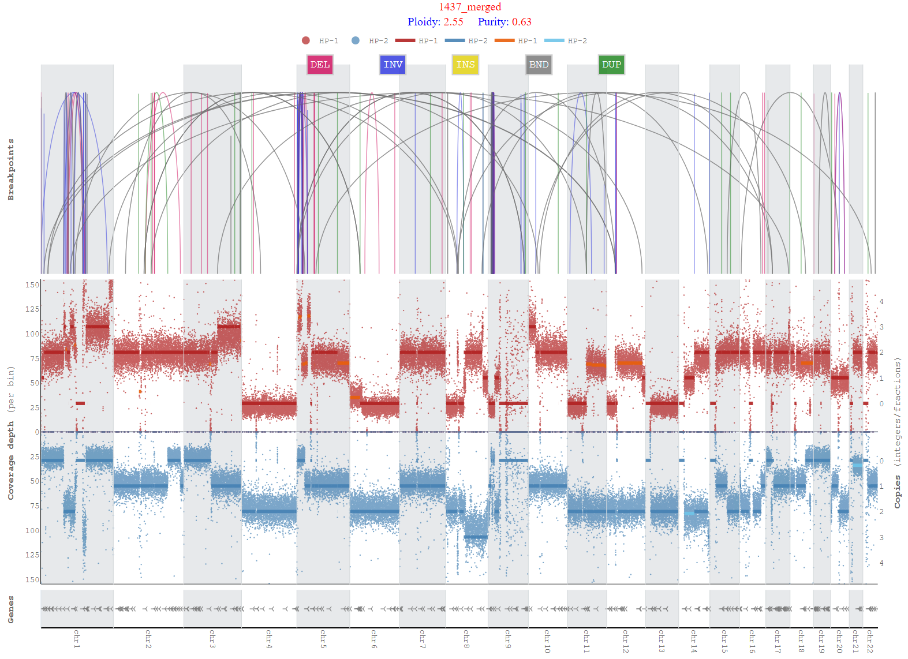
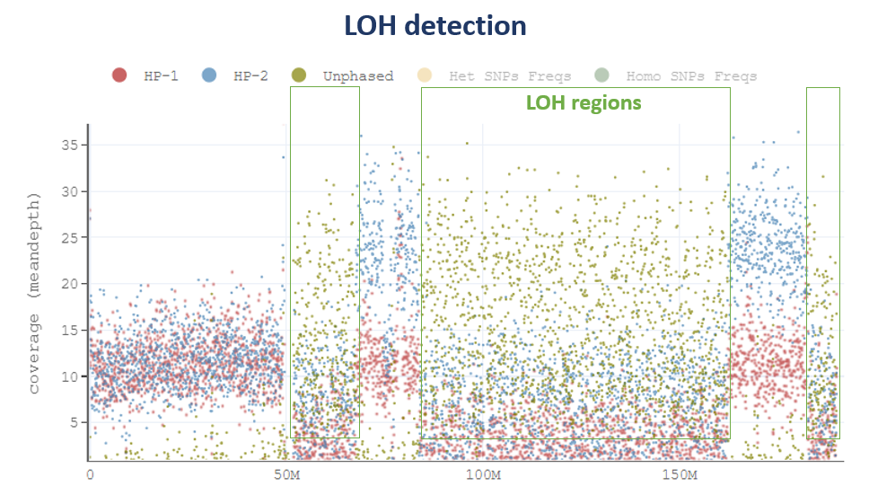
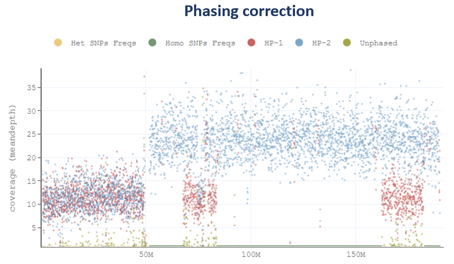
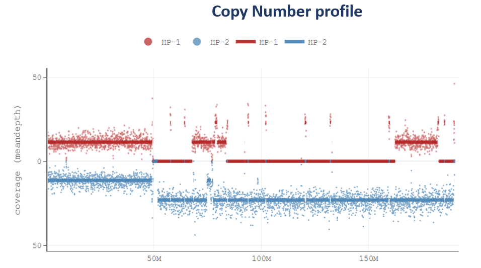
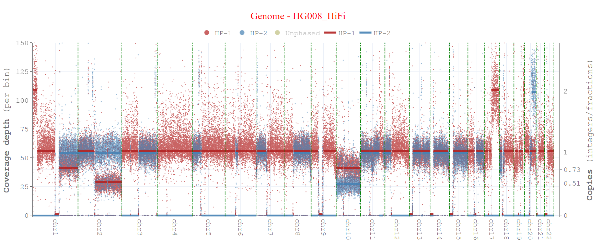
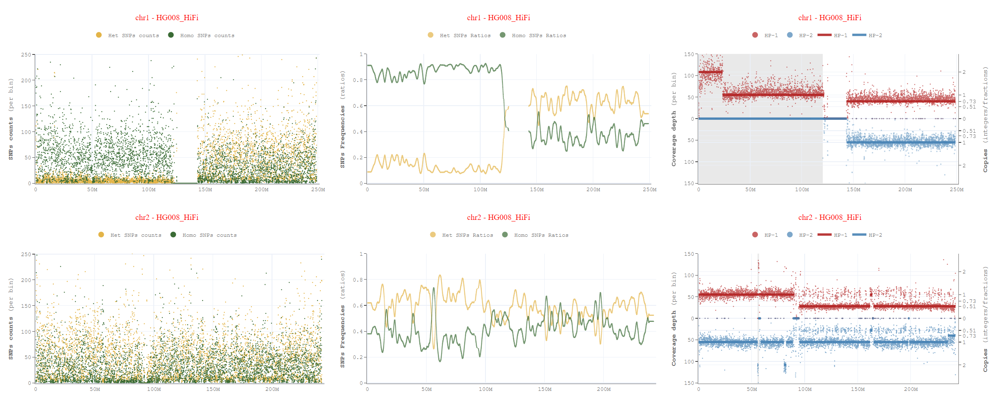
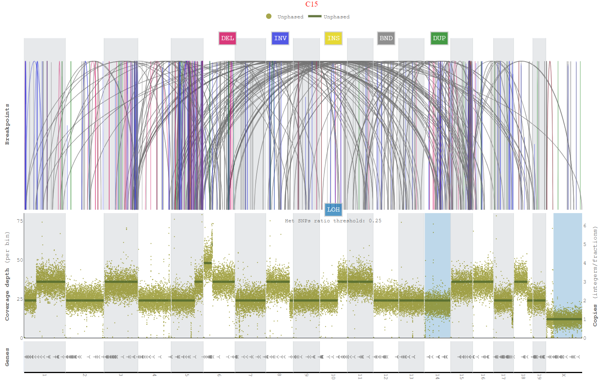

# Wakhan

A tool to analyze haplotype-specific chromosome-scale somatic copy number aberrations and aneuploidy using long reads (Oxford Nanopore, PacBio). 
Wakhan takes long-read alignment and phased heterozygous variants as input, and first extends the phased blocks and corrects phase-switch errors using [hapcorrect](https://github.com/KolmogorovLab/Wakhan/tree/main/src/hapcorrect) module, taking
advantage of the copy numbers differences between the haplotypes. Wakhan estimates purity and ploidy of the sample and generates inetractive haplotype-specific copy number and coverage plots.    

#### Breakpoints/SVs based segmentation and Copy numbers estimation:


[//]: # (#### LOH detection, phasing correction and CopyNumbers profiling &#40;COLO357&#41;:)

[//]: # (<p float="left">)

[//]: # (  )

[//]: # (   )

[//]: # (  )

[//]: # (</p>)

[//]: # (#### Copy number segmentation:)

[//]: # ()

[//]: # ()
[//]: # (#### LOH detection)

[//]: # ()

[//]: # (## Installation &#40;individual packages through conda and pip&#41;)

[//]: # (```)

[//]: # (git clone https://github.com/KolmogorovLab/Wakhan.git)

[//]: # (cd Wakhan/)

[//]: # (conda create --name Wakhan python=3.8)

[//]: # (conda activate Wakhan)

[//]: # (pip install pysam pyfaidx numpy pandas plotly scikit-learn==1.2.0 scipy==1.9.2 ruptures vcf_parser)

[//]: # (conda install -c bioconda samtools bcftools)

[//]: # (cd src/)

[//]: # (```)

## Installation (enabling through conda environment)
```
git clone https://github.com/KolmogorovLab/Wakhan.git
cd Wakhan/
conda env create -f environment.yml -n wakhan
conda activate wakhan
```

## Conda recipe installation 
```
conda create -n wakhan_env wakhan
conda activate wakhan_env
```

## Usage

Wakhan can be run as a standalone [phase-correction](https://github.com/KolmogorovLab/Wakhan/tree/main/src/hapcorrect) and copy number profiling tool using below [1] tumor-only and tumor/normal pair commands.
In case phased SVs/breakpoints, Long-Read Somatic Variant Calling pipeline mode [2] is recommended.


## 1. Standalone mode

Please refer to [prerequisite](https://github.com/KolmogorovLab/Wakhan/tree/main?tab=readme-ov-file#prerequisite) section to generate required phased VCF and breakpoints VCF.

### Tumor-Normal Mode (requires tumor BAM and normal phased VCF)
```
python wakhan.py --threads <24> --reference <ref.fa>  --target-bam <tumor.bam>  --normal-phased-vcf <normal_phased.vcf.gz>  --genome-name <cellline/dataset name> --out-dir-plots <genome_abc_output> --breakpoints <severus-sv-VCF>
```

### Tumor-only (requires tumor BAM and tumor phased VCF)
```
python wakhan.py --threads <24> --reference <ref.fa>  --target-bam <tumor.bam>  --tumor-phased-vcf <tumor_phased.vcf.gz> --genome-name <cellline/dataset name> --out-dir-plots <genome_abc_output> --breakpoints <severus-sv-VCF>
```

## 2. Phased SVs/Breakpoints pipeline mode

Severus also produces phased breakpoints/structural variations after rephasing tumor (tumor-only mode) or normal (tumor/normal pair mode) phased VCF which can be used in Wakhan by setting `--use-sv-haplotypes` param. 
This option enables to segment copy numbers boundaries in only one appropriate haplotype.

To use phased SVs/breakpoints Wakhan works in two steps, in first step it uses `hapcorrect()` module for phase-correction and generates rephased VCF, which is used to haplotag BAMs through Whatshap,
then Severus uses haplotagged BAMs to generate phased SVs. In second step, Wakhan takes this resultant Severus phased SVs VCF and runs `cna()` module with `--use-sv-haplotypes` param.

For this purpose, we have developed Nextflow based [Long-Read Somatic Variant Calling](https://github.com/KolmogorovLab/longread_somatic_nf) pipeline.
This pipeline (`Wakhan - hapcorrect` -> `Whatshap - haplotagging` -> `Severus - sv/breakpoints` -> `Wakhan - cna`) can generate Severus phased SVs/breakpoints, which could be used in Wakhan by setting `--use-sv-haplotypes` param. 

Alternatively, user can use following commands to mimic this workflow:

[//]: # (For Wakhan CNA profiling using Severus phased SVs/breakpoints, this pipeline contains following commands which could be run in this order: )

#### Tumor-Normal Mode

```
#Wakhan hapcorrect()
python wakhan.py hapcorrect --threads 16 --reference  ${REF_FASTA}  --target-bam ${BAM_T}  --normal-phased-vcf ${VCF}  --genome-name ${SAMPLE_T}

VCF='<genome_abc_output>/phasing_output/rephased.vcf.gz'

#Index for rephased VCF
tabix ${VCF}

#Haplotag Normal with rephased VCF
whatshap haplotag --reference ${REF_FASTA} ${VCF} ${BAM_N} -o ${SAMPLE_N}.haplotagged.bam --ignore-read-groups --tag-supplementary --skip-missing-contigs --output-threads=4

#Haplotag Tumor with rephased VCF
whatshap haplotag --reference ${REF_FASTA} ${VCF} ${BAM_T} -o ${SAMPLE_T}.haplotagged.bam --ignore-read-groups --tag-supplementary --skip-missing-contigs --output-threads=4

#Index for Normal haplotagged BAM 
samtools index ${SAMPLE_N}.haplotagged.bam
#Index for Tumor haplotagged BAM 
samtools index ${SAMPLE_T}.haplotagged.bam

#Severus tumor-normal mode
severus --target-bam ${SAMPLE_T}.haplotagged.bam --control-bam ${SAMPLE_N}.haplotagged.bam --out-dir severus_out \
    -t 16 --phasing-vcf ${VCF} --vntr-bed ./vntrs/human_GRCh38_no_alt_analysis_set.trf.bed

#Wakhan cna() tumor-normal mode
python wakhan.py cna --threads 16 --reference  ${REF_FASTA}  --target-bam ${BAM_T}  --normal-phased-vcf ${VCF}  --genome-name ${SAMPLE_T} \
    --breakpoints severus_out/severus_somatic.vcf --use-sv-haplotypes
```

#### Tumor-only

```
#Wakhan hapcorrect()
python wakhan.py hapcorrect --threads 16 --reference  ${REF_FASTA}  --target-bam ${BAM_T}  --tumor-phased-vcf ${VCF}  --genome-name ${SAMPLE_T} --out-dir-plots ${SAMPLE_T}

VCF='<genome_abc_output>/phasing_output/rephased.vcf.gz'

#Index for rephased VCF
tabix ${VCF}

#Haplotag Tumor with rephased VCF
whatshap haplotag --reference ${REF_FASTA} ${VCF} ${BAM_T} -o ${SAMPLE_T}.haplotagged.bam --ignore-read-groups --tag-supplementary --skip-missing-contigs --output-threads=4

#Index for Tumor haplotagged BAM 
samtools index  ${SAMPLE_T}.haplotagged.bam

#Severus tumor-only mode
severus --target-bam ${SAMPLE_T}.haplotagged.bam --out-dir severus_out -t 16 --phasing-vcf ${VCF} \
    --vntr-bed ./vntrs/human_GRCh38_no_alt_analysis_set.trf.bed --PON ./pon/PoN_1000G_hg38.tsv.gz

#Wakhan cna() tumor-only mode
python wakhan.py cna --threads 16 --reference  ${REF_FASTA}  --target-bam ${BAM_T}  --tumor-phased-vcf ${VCF}  --genome-name ${SAMPLE_T} \
    --breakpoints severus_out/severus_somatic.vcf --use-sv-haplotypes
```

## Key required/recommended parameters

* `--reference` Reference file path

* `--target-bam` path to target bam files (must be indexed)
  
* `--out-dir-plots` path to output coverage plots

* `--genome-name` genome cellline/sample name to be displayed on plots

* `--normal-phased-vcf` normal phased VCF file (tumor/normal pair mode) to generate het SNPs frequncies pileup for tumor BAM (if tumor-only mode, use phased `--tumor-phased-vcf` instead)

* `--tumor-phased-vcf` phased VCF is required in tumor-only mode

* `--breakpoints` (Highly recommended) Somatic SV calls in vcf format

* `--threads` number of threads to use

## Useful optional parameters

* `--contigs` List of contigs (chromosomes, default: chr1-22,chrX) to be included in the plots [e.g., chr1-22,chrX,chrY], Note: Please use 1-22,X [e.g., 1-22,X,Y] in case REF, BAM, and VCFs entries don't contain `chr` name/notion, same should be observed in `--centromere` and `--cancer-genes` params in case no `chr` in names, use `*_nochr.bed` instead available in `src/annotations` or customized.

* `--use-sv-haplotypes` To use phased Severus SV/breakpoints [default: disabled]

* `--cpd-internal-segments` For change point detection algo on internal segments after breakpoint/cpd algo for more precise segmentation.

* `--cut-threshold` Maximum cut threshold for coverage (readdepth) plots [default: 100]

* `--centromere` Path to centromere annotations BED file [default: annotations/grch38.cen_coord.curated.bed]

* `--cancer-genes` Path to Cancer Genes in TSV format to display in CNA plots [default: annotations/CancerGenes.tsv]

* `--pdf-enable` Enabling PDF output for plots


## 3. Unphased mode 
Wakhan can also be used in case phasing is not good in input tumor or analysis is being performed without considering phasing:

* `--without-phasing` Enable it if CNA analysis is being performed without phasing in conjunction with `--phaseblock-flipping-disable` and `--histogram-coverage` with all other required parameters as mentioned in example command

A sample command-line for running unphased mode (Mouse WGS data) could be:
```
python wakhan.py --threads <> --reference <mouse_ref>  --target-bam <tumor_bam>  --cut-threshold 75  --normal-phased-vcf <phased_normal.vcf.gz> --out-dir-plots <mouse_output> --genome-name mouse --copynumbers-subclonal-enable --loh-enable --breakpoints <severus_somatic.vcf> --contigs <chr1-19,chrX> --without-phasing --phaseblock-flipping-disable --histogram-coverage  --centromere <annotations/mouse_chr.bed> --cpd-internal-segments  --hets-ratio 0.4  --hets-smooth-window 10
```

Here is a sample copy number/breakpoints output plot without phasing for a mouse subline dataset.


##### Breakpoints/Structural variations or change point detection algo for copy number model

Wakhan accepts [Severus](https://github.com/KolmogorovLab/Severus) structural variants VCF as breakpoints with param `--breakpoints` inputs to detect copy number changes and this option is highly recommended. 
However, if `--breakpoints` option is not used, `--change-point-detection-for-cna` should be used instead to use change point detection algorithm [ruptures](https://centre-borelli.github.io/ruptures-docs/) alternatively.

##### Tumor-Normal mixture and purity/ploidy estimation

User can input both `--ploidy-range` [default: 1.5-5.5 -> [min-max]] and `--purity-range` [default: 0.5-1.0 -> [min-max] to inform copy number model about normal contamination in tumor to estimate copy number states correctly.

##### Genes/copy number annotations

By default, Wakhan uses [COSMIC](https://cancer.sanger.ac.uk/cosmic) cancer census genes (100 genes freely available) to display corresponding copy number states in `<genome_name>_<ploidy>_<purity>_<confidence>_genes_genome.html` file.
Complete COSMIC academic/research purpose cancer census genes set (Cosmic_CancerGeneCensus_v101_GRCh38.tsv) could be downloaded from [COSMIC](https://cancer.sanger.ac.uk/cosmic/download/cosmic/v101/cancergenecensus).
Please run the `scripts/cosmic.py` to extract the required fields and then input resultant `cosmic_genes.tsv` in param `--user-input-genes`.
Alternatively, user can also input path through param `--user-input-genes` to custom input genes/subset of genes [examples in src\annotations\user_input_genes_example_<N>.bed] bed file these genes will be used in plots instead of default COSMIC cancer genes.
grch38 reference genes will be use as default, user can input alternate (i.e, chm13) `--reference-name` to change to T2T-CHM13 coordinates instead. 


##### Quick-run if coverage/pileup data is already available

Wakhan produces reads coverage `coverage.csv` (bin-size based reads coverage) and phasesets reads coverage `coverage_ps.csv` data, phase-corrected coverage `phase_corrected_coverage.csv` (as well as tumor BAM pileup `pileup_SNPs.csv` in case Tumor/normal mode) and stores in directory `coverage_data` inside `--out-dir-plots` location.
If this data has already been generated in a previous Wakhan run, user can rerun the Wakhan with additionally passing `--quick-start` and `--quick-start-coverage-path <path to coverage_data directory -> e.g., /home/rezkuh/data/1437/coverage_data>` in addition to required params in above example runs.
This will save runtime significantly by not invoking coverage and pileup methods. 

[//]: # (## Note)

[//]: # (If for some reason you have already generated coverage and pileup data from Wakhan &#40;as pileup takes some time&#41; and want to rerun the tool, you can avoid generating coverage/pileup data again by copying this data and using it again:)

[//]: # (1. Copy `coverage.csv`, `coverage_ps.csv` and `<Your genome name>_SNPs.csv` files from `data/` output dir &#40;it should be in src&#41; of your current run to some separate directory i.e.,  `/home/abc/dry_run_data`.)

[//]: # (2. Then run again the tool with adding this command additional to what you use already: `--dryrun True` `--dryrun-path` <This is the path where you copied CSVs files in step-1, ie. like, `/home/abc/dry_run_data/`>)

## Examples
Few cell lines arbitrary phase-switch correction and copy number estimation output with coverage profile is included in the [examples](https://github.com/KolmogorovLab/Wakhan/tree/main/examples) directory. 


## Output produced
Based on best confidence scores, tumor purity and ploidy values are calculated and solution(s) are ranked accordingly with output as `solution_<N>` symlink directories. 
Each sub-folder in output directory represents best <`ploidy`>_<`purity`>_<`confidence`> values.

* `<genome-name>_genome_copynumber_details.html` Genome-wide copy number plots with coverage information on same axis
* `<genome-name>_copynumber_breakpoints.html` Genome-wide copy number plots with coverage information on opposite axis, additionally breakpoints and genes annotations 
* `<genome-name>_copynumber_breakpoints_subclonal.html` Genome-wide subclonal/fractional copy number plots with coverage information on opposite axis, additionally breakpoints and genes annotations (`--copynumbers-subclonal-enable`)
* `bed_output` It contains copy numbers segments in bed format
* `vcf_output` It contains copy numbers segments in VCF format
* `variation_plots` Copy number chromosomes-scale plots with segmentation, coverage and LOH

Following are coverage and SNPs/LOH plots and bed directories in output folder, independent of CNA analysis

* `snps_loh_plots` SNPs and SNPs ratios plots with LOH representation in chromosomes-scale and genome-wide (in tumor-only mode)
* `<genome-name>_genome_loh.html` Genome-wide LOH plot (in tumor-only mode)
* `coverage_plots` Haplotype specific coverage plots for chromosomes with option for unphased coverage
* `coverage_data` Haplotype specific phase-corrected coverage data including SNPs pileup
* `phasing_output` Phase-switch error correction plots and phase corrected VCF file (rephased.vcf.gz)


## Prerequisite

### Phased VCF

Wakhan requires tumor BAM and normal phased VCF (in case tumor-normal mode) or tumor phased VCF (in case tumor-only mode).
Following [Clair3](https://github.com/HKU-BAL/Clair3) command with [longphase](https://github.com/twolinin/longphase) as phasing tool is recommended for generating required phased VCF.

#### For normal/tumor pair (generating normal phased-vcf):
```
BAM= Path to normal BAM
```
#### For tumor-only (generating tumor phased-vcf):
```
BAM= Path to tumor BAM
```
Running Clair3 on BAM with `--enable_phasing --longphase_for_phasing` for germline variants:
```
#For ONT data
clair3 --bam_fn=${BAM} --ref_fn=${REF_FASTA} --threads=${THREADS} --platform=ont --model_path=</clair3_models/r1041_e82_400bps_sup_v420/> --output=${OUTPUT_DIR} --enable_phasing --longphase_for_phasing

#For PacBio data
clair3 --bam_fn=${BAM} --ref_fn=${REF_FASTA} --threads=${THREADS} --platform=hifi --model_path=</clair3_models/hifi/> --output=${OUTPUT_DIR} --enable_phasing --longphase_for_phasing
```

### SV/Breakpoints VCF (Phased SVs/Breakpoints, optional)

We also recommend to use [structural variants (breakpoints)](https://github.com/KolmogorovLab/Wakhan/tree/main?tab=readme-ov-file#breakpointsstructural-variations-or-change-point-detection-algo-for-copy-number-model) in Wakhan, please refer to [Severus](https://github.com/KolmogorovLab/Severus).
To used phased SVs/Breakpoints please refer to generating [Severus phased SVs](https://github.com/KolmogorovLab/Wakhan/tree/main?tab=readme-ov-file#phased-breakpointsstructural-variations) section.
