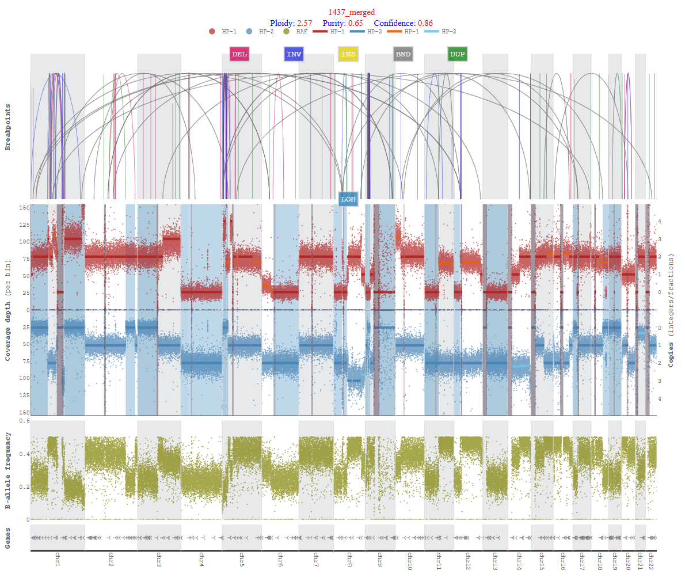

# Wakhan

###### Note: This repository is under extensive updates.

A tool to analyze haplotype-specific chromosome-scale somatic copy number aberrations and aneuploidy using long reads (Oxford Nanopore, PacBio). 
Wakhan takes long-read alignment and phased heterozygous variants as input, and first uses extends the phased blocks, taking
advantage of the CNA differences between the haplotypes. Wakhan then generates inetractive haplotype-specific coverage plots.    

#### Phasing errors:


#### Phasing errors correction:


#### Copy number segmentation:


#### LOH detection, phasing correction and CopyNumbers profiling (COLO357):
<p float="left">
  
   
  
</p>

## Installation (enabling through conda environment)
```
git clone https://github.com/KolmogorovLab/Wakhan.git
cd Wakhan/
conda create --name Wakhan python=3.8
conda activate Wakhan
pip install  pysam  pyfaidx numpy pandas Bio scipy ReportLab==3.6.12 matplotlib py plotly hmmlearn tqdm>=4.24.0 numba>=0.43.0 nose pomegranate==0.14.8 scikit-genome==0.0.1 scikit-learn==1.2.0 scipy==1.9.2  matplotlib==3.6.2 kneed ruptures
conda install -c bioconda samtools bcftools
cd src/
```

<!-- conda env create -f environment.yml -n Wakhan -->

## Usage
```
python main.py --threads 4 --reference <ref.fa>  --target-bam <data.haplotagged.bam>  --out-dir-plots coverage_plots  --phased-vcf <data.phased.vcf.gz>  --smoothing-enable True --copynumbers-enable True  --unphased-reads-coverage-enable True --phaseblock-flipping-enable True  --genome-name <cellline/dataset name> --cut-threshold 150 --het-phased-snps-freq-enable True
```

## Prerequisite
This tool requires haplotagged BAM and phased VCF. This can be done through any phasing tools like Margin, Whatshap and Longphase. 
Following commands could be helpful for phasing VCFs and haplotagging BAMs.

#### For normal/tumor pair:
```
# ClairS phase and haplotag both normal and tumor samples
singularity run clairs_latest.sif /opt/bin/run_clairs --threads 56 --phase_tumor True --use_whatshap_for_final_output_haplotagging --use_whatshap_for_final_output_phasing --tumor_bam_fn normal.bam --normal_bam_fn tumor.bam --ref ref.fasta --output_dir clairS --platform ont_r10
```
or
```
# Phase normal sample
pepper_margin_deepvariant call_variant -b normal.bam -f ref.fasta -o pepper/output -t 56 --ont_r9_guppy5_sup -p pepper --phased_output

# Haplotag tumor sample with normal phased VCF (phased.vcf.gz) output from previous step
whatshap haplotag --ignore-read-groups phased.vcf.gz tumor.bam  --reference ref.fasta -o tumor_whatshap_haplotagged.bam
```
#### For tumor only:
```
# Phase and haplotag tumor sample
singularity run clair3_latest.sif /opt/bin/run_clair3.sh --use_whatshap_for_final_output_haplotagging --use_whatshap_for_final_output_phasing --bam_fn=tumor.bam --ref_fn=ref.fasta --threads=56 --platform=ont --model_path=r941_prom_sup_g5014 --output=clair3 --enable_phasing
```
or
```
# Phase and haplotag tumor sample
pepper_margin_deepvariant call_variant -b tumor.bam -f ref.fasta -o pepper/output -t 56 --ont_r9_guppy5_sup -p pepper --phased_output
```

## Examples
Few cell lines arbitrary phasing output with coverage profile is included in the [examples](https://github.com/KolmogorovLab/Wakhan/tree/devel/examples) directory. 

## Required parameters

* `--target-bam` path to one or multiple target bam files (must be indexed)
  
* `--out-dir-plots` path to output coverage plots

* `--genome-name` genome cellline/sample name to be displayed on plots

* `--phased-vcf` phased VCF file for the corresponding haplotagged BAM

  
## Optional parameters
  
* `--phaseblock-flipping-enable` enabling phaseblock flipping in coverage plots
  
* `--smoothing-enable` enabling smoothing in coverage plots

* `--phaseblocks-enable` enabling phaseblocks display in coverage plots

* `--het-phased-snps-freq-enable` enabling heterozygous phased snps frequencies in coverage plots

* `--breakpoints-enable` enabling breakpoints in coverage plots

* `--phased-vcf-snps-freqs` phased VCF file to plot snps frequencies coverages along BAM coverage

* `--contigs` List of contigs (chromosomes, default:chr1-22) to be included in the plots [e.g., chr1-22,X,Y]