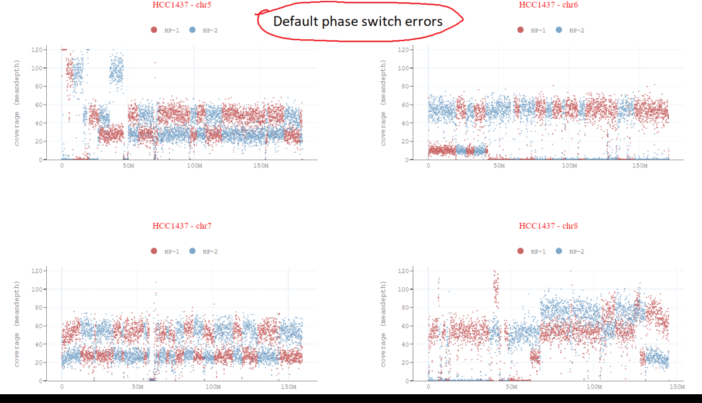

# SomaticCNA

###### Note: This repository is under extensive updates. Currently, only haplotagged BAM file phasing correction and coverage plots modules are working.

This tool intends to generate haplotype-specific somatic copy number aberrations/profiling from long reads (Oxford Nanopore, PacBio) sequencing data. 
To achieve this accurately, first phase switch errors which occurs due to multiple artifacts related to lower coverage, LOH, etc., are being fixed. 
Haplotype-specific coverage plots and phased heterozygous SNPs frequencies plots are also being generated.    



## Requirements:
* Python3
* Plotly
* Samtools
* Pysam
* Bcftools

## For NIH Biowulf HPC
```
module load samtools
module load bcftools
```

## Installation
```
git clone https://github.com/KolmogorovLab/SomaticCNA.git
cd SomaticCNA/src
```

## Prerequisite
This tool requires haplotagged BAM and phased VCF. This can be done through any phasing tools like Margin, Whatshap and Longphase. 
Following commands could be helpful for phasing VCFs and haplotagging BAMs.

#### For normal/tumor pair:
```
# ClairS phase and haplotag both normal and tumor samples
singularity run clairs_latest.sif /opt/bin/run_clairs --threads 56 --phase_tumor True --use_whatshap_for_final_output_haplotagging --use_whatshap_for_final_output_phasing --tumor_bam_fn normal.bam --normal_bam_fn tumor.bam --ref ref.fasta --output_dir clairS --platform ont_r10
```
or
```
# Phase normal sample
pepper_margin_deepvariant call_variant -b normal.bam -f ref.fasta -o pepper/output -t 56 --ont_r9_guppy5_sup -p pepper --phased_output

# Haplotag tumor sample with normal phased VCF (phased.vcf.gz) output from previous step
whatshap haplotag --ignore-read-groups phased.vcf.gz tumor.bam  --reference ref.fasta -o tumor_whatshap_haplotagged.bam
```
#### For tumor only:
```
# Phase and haplotag tumor sample
singularity run clair3_latest.sif /opt/bin/run_clair3.sh --use_whatshap_for_final_output_haplotagging --use_whatshap_for_final_output_phasing --bam_fn=tumor.bam --ref_fn=ref.fasta --threads=56 --platform=ont --model_path=r941_prom_sup_g5014 --output=clair3 --enable_phasing
```
or
```
# Phase and haplotag tumor sample
pepper_margin_deepvariant call_variant -b tumor.bam -f ref.fasta -o pepper/output -t 56 --ont_r9_guppy5_sup -p pepper --phased_output
```

## Usage
```
python3 main.py --target-bam <tumor_haplotagged.bam> --out-dir-plots <coverage_plots> --genome-name <cellline/sample name> --phased-vcf <phased.vcf.gz>
```
## Examples
Few cell lines arbitrary phasing output with coverage profile is included in the [examples](https://github.com/KolmogorovLab/SomaticCNA/tree/main/examples) directory. 

## Required parameters

* `--target-bam` path to one or multiple target bam files (must be indexed)
  
* `--out-dir-plots` path to output coverage plots

* `--genome-name` genome cellline/sample name to be displayed on plots

* `--phased-vcf` phased VCF file for the corresponding haplotagged BAM
  
## Optional parameters
  
* `--phaseblock-flipping-enable` enabling phaseblock flipping in coverage plots
  
* `--smoothing-enable` enabling smoothing in coverage plots

* `--phaseblocks-enable` enabling phaseblocks display in coverage plots

* `--het-phased-snps-freq-enable` enabling hetrozygous phased snps frequencies in coverage plots

* `--breakpoints-enable` enabling breakpoints in coverage plots

* `--phased-vcf-snps-freqs` phased VCF file to plot snps frequencies coverages along BAM coverage

  
