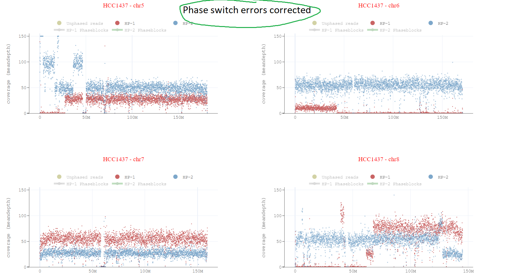

# hapcorrect

hapcorrect takes long-read alignment and phased heterozygous variants as input, and corrects the haplotypes phase-switching errors in BAMs around phased blocks as well as inside phase-blocks.

#### Phasing errors:

#### Phasing errors correction:

## Usage 
hapcorrect works with both tumor/normal pair and tumor-only data. 
To generate input for hapcorrect please follow the [following](https://github.com/KolmogorovLab/Wakhan/tree/main?tab=readme-ov-file#prerequisite) instructions.

## Note:
In some cases, phaseblocks are not good enough for `hapcorrect` to correct phase-switch errors (too small phaseblocks), in that scenario, user can set `enable-simple-heuristics` parameter to apply simple heuristics which will assign higher coverage bins values to HP-1 and lower bins coverage values to HP-2.  